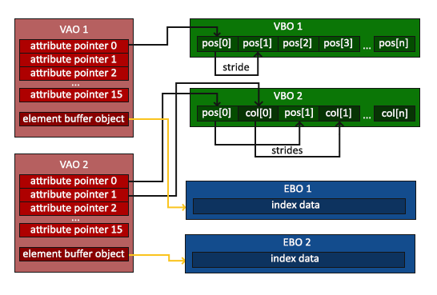

#noname
A game inspired by minecraft developed with OpenGL. I haven't come up with the name of this game.

## build
Download and build correspond version of GLFW and glad library. Use cmake to build and run (see `With CMake and GLFW 
source` in GLFW official website. `glfw` folder is the GLFW source).

If you use Clion, don't forget to set working directory to the project's root directory, in case the relative path in 
this project prefix with `./build/`

## tools
* Manjaro (Linux distro)
* C++
* OpenGL(GLFW+glad)
* cmake

## documentation

## reference
* [learnopengl.com](https://learnopengl.com/)
* 
* [cmake-example](https://github.com/ttroy50/cmake-examples)

## notes
* ways to debug in opengl: console, `glGetError()` and some other GUI tools
